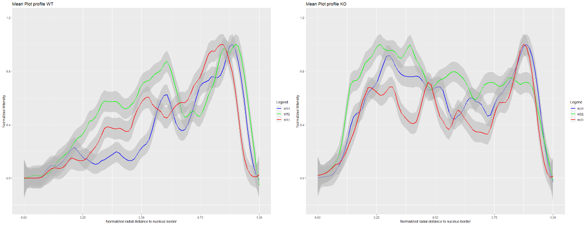

# Determining-the-intracellular-position

How to use the imageJ macro and R script to produced the normalized distance profile graph (normalized in X and Y from 0 to 1)  

1) Install the plugin radial profile NN.class in Fiji/plugin
The plugin radial profile was modified to Not Normalized (NN) to produce the real radial profile we observe in the image

2) Run the Fifi macro on the different images on the zenodo link  

3) Run the script named "Radial Profile.R" for each experiment (WT and KO, exp1, exp2, exp3) to produce a normalized profile in X  and Y

4) run "Mean Profile_09a2021_KO_overlay.R" and "Mean Profile_09a2021_WT_overlay.R" to produce the pool profile for WT1,2,3 and KO1,2,3 with the smooth profile (loess method) and the confidence interval (not the standard deviation)

5) You will obtain the two curves  (KO.tiff ands WT.tiff)

This plugin was modified to Not Normalized (NN) to produce the real radial profile we observe in the image

