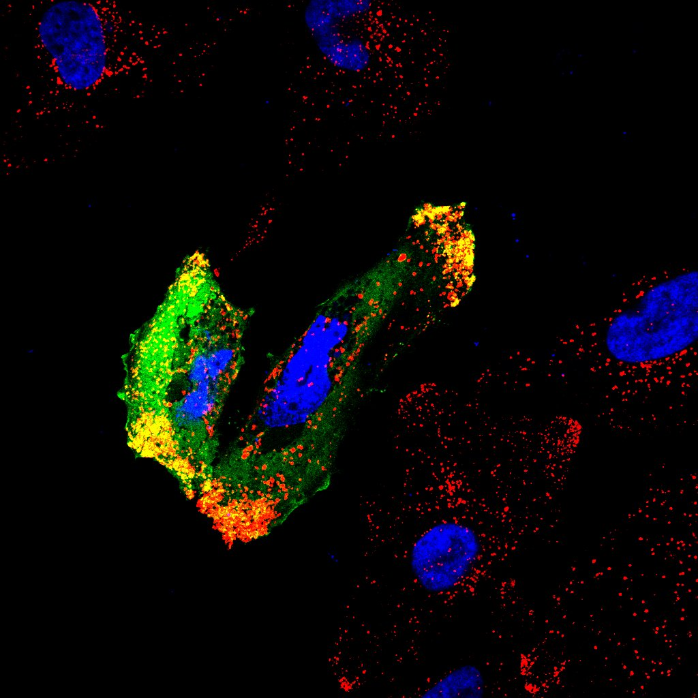
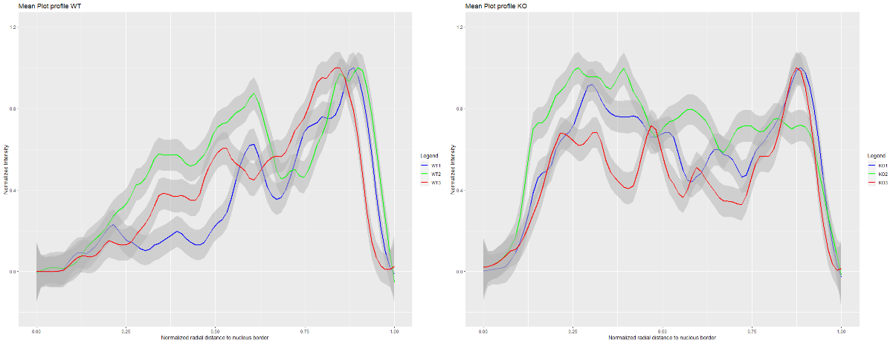

# Determining-the-intracellular-position

How to use the imageJ macro and R script to produced the normalized distance profile graph (normalized in X and Y from 0 to 1)  

1) Install the plugin radial profile NN.class in Fiji/plugin.
The plugin radial profile was modified to Not Normalized (NN) to produce the real radial profile we observe in the image

2) Run the Fiji macro "radial_profile_version3.ijm" on the different images (use the czi file) 
 

3) Run the script named "Radial Profiles_normalisation_0to1.R" for each experiment containing 20 radial profiles to produce  normalized profiles in X  between 0 to 1 for each profile

4) Run "Mean Profile_09a2021_KO_overlay.R" and "Mean Profile_09a2021_WT_overlay.R" to produce the pool profile for WT1,2,3 and KO1,2,3 with the smooth profile (loess method) and the confidence interval

5) You will obtain the two curves (WT.tiff and KO.tiff)

