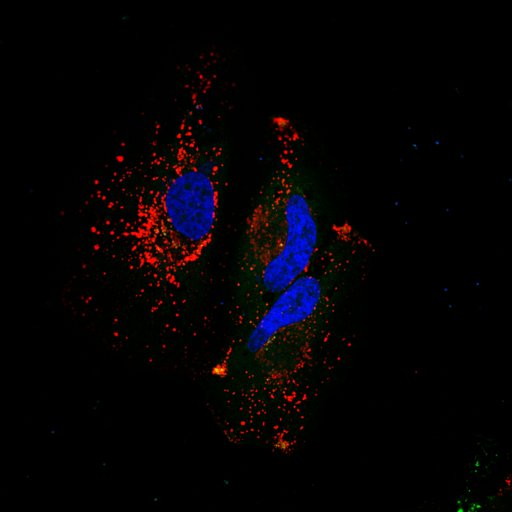

# Determining-the-intracellular-position

How to use the imageJ macro and R script to produced normalized distance profile graph normalized in X and Y from 0 to 1 : 

1) Install the plugin "radial profile NN.class" in Fiji/plugin.
The plugin radial profile (https://imagej.nih.gov/ij/plugins/radial-profile.html) was modified to produce a non normalized radial profile

2) Run the Fiji macro "radial_profile_version3.ijm" on the different images (use the czi file) 
 

3) Run the script named "Radial Profiles_normalisation_0to1.R" for each experiment containing 20 radial profiles to produce  normalized profiles in X  between 0 to 1 for each profile

4) Run the R script "Normalize_in _Y_and_Mean_Profiles.R" for the WT and KO experiment to normalize the 20 profiles in Y and mean them togoether using the smooth profile (loess method) and the confidence interval

5) You will obtain the two graphs  WT and KO for 3 different experiments

